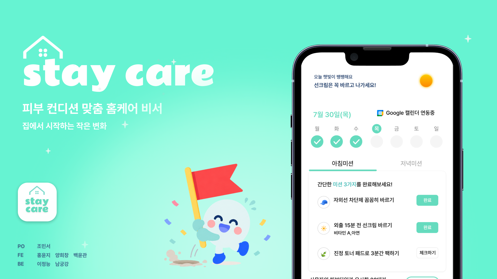
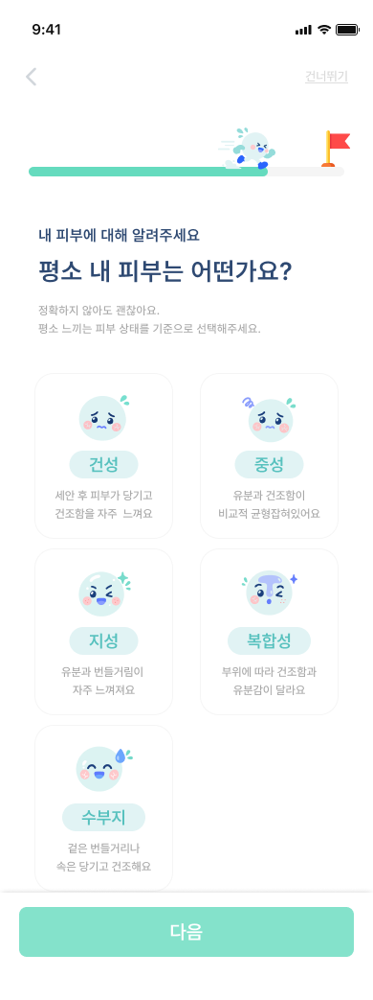
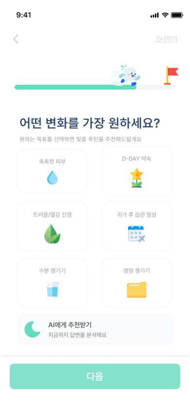
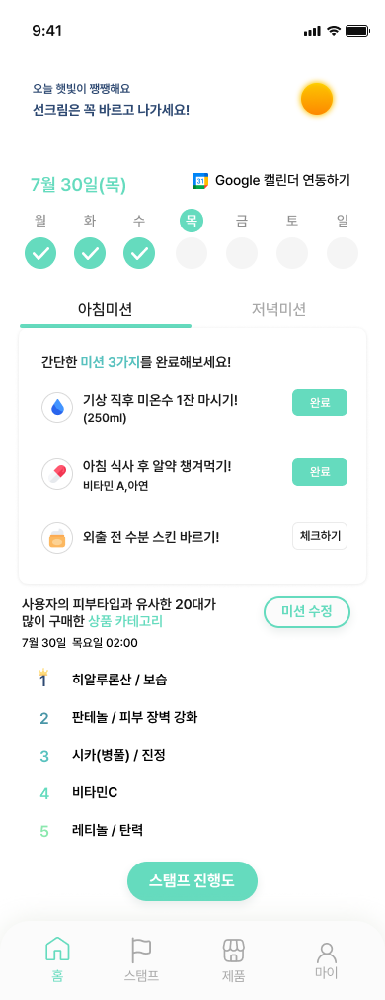
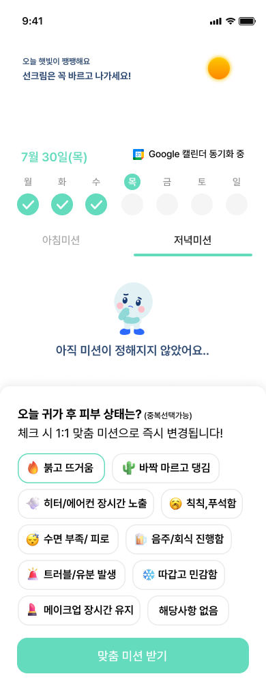
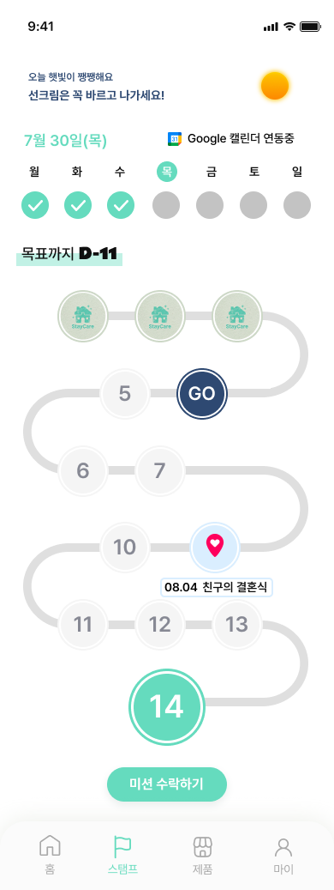
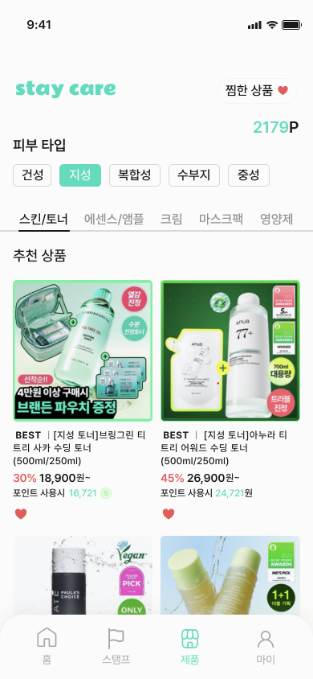

# 🏠 Stay:Care

> **날씨 · 일정 · 피부 컨디션을 기반으로, 매일 나에게 필요한 케어 미션을 추천하는 개인 맞춤형 홈케어 서비스입니다.**
> 

## 🚀 Deployment

> 🌐 **Stay:Care 서비스를 직접 만나보세요!**
[**Stay:Care 바로가기 →**](https://hackathon-staycare.netlify.app/)

## 💡 서비스 소개

**Stay:Care**는 바쁜 일상 속에서 피부 관리를 꾸준히 이어가기 어려운 **2030 직장인과 대학생을 위한 개인 맞춤형 홈케어 서비스**입니다.

복잡한 뷰티 정보를 직접 검색하고 매번 관리 방법을 고민하는 대신, 사용자의 **피부 타입과 당일 컨디션, 날씨, 개인 일정**을 반영해 그날 필요한 **아침 · 저녁 케어 미션을 맞춤 추천**합니다.
또한 **7 · 14 · 21 · 28일 목표 코스와 스탬프 시스템**을 통해 단순한 반복 알림이 아닌 명확한 목표를 제공하여, 사용자가 부담 없이 케어를 실천하고 꾸준한 관리 습관을 만들어갈 수 있도록 돕습니다.

> **검색은 줄이고, 고민 없이 오늘 나에게 필요한 케어에 집중할 수 있도록!** Stay:Care가 매일의 상황에 맞는 케어를 함께합니다.

## ✨ 주요 기능

### 01. 맞춤형 자가진단 & AI 케어 추천
사용자의 **피부 타입과 생활 패턴, 관리 목표**를 간단한 자가진단을 통해 파악합니다.
입력한 정보를 기반으로 사용자의 현재 상태와 목표에 맞는 **개인 맞춤형 케어 미션과 루틴을 추천**합니다.

  
  

### 02. 날씨 · 일정 기반 모닝 케어
오늘의 **날씨와 개인 일정**을 반영하여 외출 전 실천할 수 있는 맞춤형 아침 케어 미션을 제공합니다.
Google Calendar와 연동된 일정과 사용자 정보를 바탕으로, 매일 필요한 **3가지 모닝 미션과 맞춤 성분**을 확인할 수 있습니다.

### 03. 당일 컨디션 기반 이브닝 케어
하루 동안 달라진 **피부 상태와 생활 컨디션**을 간단하게 체크하면, 현재 상태에 필요한 저녁 케어 미션을 맞춤형으로 제공합니다.
고정된 루틴을 반복하는 대신 **그날의 컨디션을 반영해 미션을 재구성**하여 필요한 케어에 집중할 수 있습니다.

### 04. 목표 주기 & 스탬프 관리
사용자가 선택한 **7 · 14 · 21 · 28일 관리 주기**에 따라 목표까지의 진행 상황을 스탬프로 기록합니다.
개인 일정의 **D-Day를 함께 확인**하며 매일의 미션 수행 과정을 시각적으로 확인할 수 있어 꾸준한 케어 습관 형성을 돕습니다.

### 05. 피부 타입 기반 맞춤 제품 큐레이션
사용자의 **피부 타입에 맞는 스킨케어 제품을 카테고리별로 추천**하여 복잡한 제품 탐색 과정을 줄여줍니다.
추천 제품의 가격과 할인 정보뿐만 아니라 보유 포인트를 적용한 가격을 함께 확인하고, 관심 있는 제품은 찜하여 관리할 수 있습니다.

## 🛠 기술 스택

| 구분 | 기술 |
| --- | --- |
| **Frontend** | React 19, JavaScript (ES6+), Vite 8, Tailwind CSS 4 |
| **State & Routing** | Zustand 5, React Router DOM 7 |
| **API** | Axios, REST API |
| **Backend** | Java, Spring Boot, JPA |
| **Database** | MySQL |
| **Cloud & Infrastructure** | AWS, AWS S3, Docker |
| **CI/CD** | GitHub Actions |
| **External Service** | Google Calendar OAuth |
| **API Documentation** | OpenAPI, Swagger UI, springdoc-openapi |
| **Collaboration** | GitHub, Figma, Notion |

## 👥 팀원

 &nbsp;
 &nbsp;
 &nbsp;
 &nbsp;
 &nbsp;

## 📂 Repository

### 💻 Frontend
> Stay:Care의 사용자 인터페이스 및 클라이언트 기능을 담당합니다.  
> [**Frontend Repository →**](https://github.com/hackathon-team06/frontend)

### ⚙️ Backend
> Stay:Care의 REST API, 데이터 관리 및 서버 기능을 담당합니다.  
> [**Backend Repository →**](https://github.com/hackathon-team06/backend)
---

### 🦁 멋쟁이사자처럼 대학 14기 중앙해커톤 6팀
